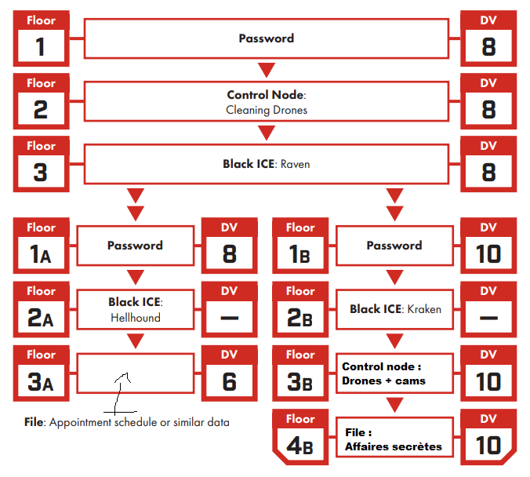

A session based on the scenario *Agency Job*, where the Edgerunners infiltrate an embassy to steal sensitive data, uncovering everyday cybersecurity flaws through gameplay.

<!--more-->



## Event Details

- **System:** Cyberpunk Red
- **Location:** François Villon Media Library, Bourg la Reine
- **Theme:** Cyberpunk, heist, cyber hygiene
- **Number of Players:** 2
- **Duration:** 3h30
- **Scenario:** Agency Job, taken from the Cyberpunk 2020 book *Tales from the Forlorn Hope*



## About the Session/Workshop
My aim for this session was to offer a simple scenario on which I could easily improvise based on the players' ideas, showcasing some cybersecurity best practices. 

The premise was as follows:
- The Colombian embassy uses a boat to secretly transport men and equipment in and out of Night City.
- The Edgerunners aim to make a name for themselves at the Forlorn Hope, a highly selective bar for veterans and tough types *(initial hook)*.
- Kronos, a fixer associated with the CIA, approaches them and offers to retrieve the boat's name:
  - He doesn't provide too many details but enough for them to realize the risks.
  - If they succeed, they gain the trust of the regulars; if they fail, Kronos will find other scapegoats to burn...

I had prepared the embassy floor plan, indicating the positions of the guards and some NPCs: 

> *Note:* 
> *I know it's preferable to use an [adversary roster](https://thealexandrian.net/wordpress/45091/roleplaying-games/design-notes-adversary-rosters), but having them on the map allowed me to quickly navigate, which was sufficient for a one-shot.*

I also had a simple architecture (noticing the shameless and dirty recycling of the core book's architecture), in case a Netrunner joined, which ultimately didn't happen.

I mainly prepared by rereading [Justin Alexander's posts](https://thealexandrian.net/wordpress/41217/roleplaying-games/dragon-heist-remix-part-1-the-villains) on heists throughout the *Waterdeep: Dragon Heist* campaign, and I planned to divide the session into 3 parts:
### **1. Reconnaissance:**
   
   Reacting to the players' ideas to give them as much information as possible about the locations. They had 48 hours to complete the mission, and Kronos advised them not to rush headlong after the briefing. I had some ideas in mind to allow them to trace an interesting plan: 
   - Follow an employee leaving work and steal/cloning their badge.
   - Make a visit pretending to have an appointment.
   - [Research online](https://fr.wikipedia.org/wiki/Renseignement_d%27origine_sources_ouvertes) to discover:
     - A casino site intern's password had leaked, and he reused the same password for his access to the embassy. This would have allowed them to create an appointment with an embassy member or even transmit a virus to another agent, thus gaining access to the embassy's internal network, to observe via cameras and disable them at the opportune moment, for example. 
     - The cleaning company for the company was easily found online, it was possible to pass as a cleaning agent by bribing a lax employee. 
     - The two receptionists were in a relationship and pretended to be sick but posted photos of their vacation online, possibility of blackmail.
     - *More difficult:* One of the security guards (affiliated with Arasaka) was involved in arms trafficking on the black market. Here too, blackmail was possible with more risks but also potentially much profit to be made.
### **2. Infiltration:**
   
   There were 3 main obstacles to overcome to access the vault, and reconnaissance was to allow the Edgerunners to prepare a plan to bypass them in one way or another:
   - *Enter the building:* Located on the 10th floor of a megabuilding, the entrance had a metal detector gate, two guards, and receptionists.
   - *A defense network:* Cameras and defense drones directly linked to Arasaka, with a response team dispatched within 10 minutes.
   - *About ten guards:* All from Arasaka, armed and disciplined (almost). Potentially the biggest danger, ensuring that infiltration would not start with a shootout.
   - *A hidden code safe:* The surprise at the end, the Edgerunners had little information on the location of the documents they were looking for, and the safe was there to propose an unexpected event at the tensest moment, when they would be in the ambassador's office. The code was a puzzle whose construction will be the subject of a separate post but quickly: safe hidden behind a reproduction of the Water Lilies, the code was 9 digits. In a desk drawer, the post-it "REMINDER: he did the Water Lilies", the code was 666666338, Monet written on a T9 keyboard.
  


### **3. Escape and Surprise:**

  For this part, very little preparation in reality. Generally at this point in a Cyberpunk scenario, half of Night City is in the streets, spitting fire, and our chooms are running under a hail of bullets searching for a place to lay low. I've never managed to implement a truly satisfying chase scene, so I planned to handle this one as a [skill challenge](https://koboldpress.com/skill-challenges-for-5e-part-1/), to avoid prolonging the session too much without neglecting this part of the heist too much. 

  As an ace up my sleeve, I optionally planned to end the session as the scenario suggests: Kronos asks the Edgerunners to locate the boat off the coast of Night City Bay and to take it down. He provides them with diving equipment, the boat, and explosives, and warns them of the detection perimeter around and under the boat. An explosive finale to reward an efficient group. 

## Event Recap (Post-Event)

Only 2 of the 5 registered attendees showed up (12 and 14 years old), the first time this has happened but it was probably due to the flu raging exactly during that period. The two participants chose their [pre-generated characters](https://rtalsoriangames.com/wp-content/uploads/2021/02/RTG-CPRed-SingleShotPackv1.1.pdf): Forty the Rockergirl and Mover the Solo. 

> **No Netrunner?**
> I introduced Redeye, the Netrunner from the pre-generated pack, as an NPC, the third member of their crack team, the [guy in the chair](https://www.youtube.com/watch?v=8nAK0Ifptzc). He wasn't particularly proactive but allowed them to disable the surveillance cameras once the edgerunners managed to connect him to the embassy network (he had to make a roll for that, if he had failed, he would have triggered the alarm. NPCs are not infallible).

Rare thing, the scenario unfolded almost exactly as I had prepared it! Quickly caught up in the excitement of robbing a heavily guarded building, the edgerunners focused on the guards and janitors. They managed to get hold of 2 guards:
- Jake, a Forty fan from day one, whom he had the opportunity to meet while Mover took his dog hostage to force him to cooperate (a tense and funny moment).
- Blake, who was trafficking weapons on the black market and was caught red-handed by the heroes. 
The guards both agreed to turn off the entrance gate for the edgerunners to enter with their weapons, disguised as janitors after bribing the real employees. The receptionists then reluctantly agreed to plug in the USB key (a role-play shard if you will) handed to them by Jake, threatening to reveal the real reason for their recent absence, while the edgerunners headed upstairs. 
After some good rolls and clever interactions, Mover found himself in the ambassador's office while Forty pretended to clean in front. But she was recognized by the ambassador's secretary, who was working overtime, and things started to heat up outside the office. 

As Forty began to hose down the guards who had unmasked her, Mover eventually found the safe code, and both rushed out of the embassy in a intense shootout where Mover almost lost his life protecting his partner. Once outside, they realized they had forgotten an important aspect of their plan: **the getaway**. Fortunately, Blake arrived at that moment to pick them up and asked for 25% of their loot in exchange for his rescue (in Night City, no one is kind for free...). 

Normally, I would have stopped there. The session was already 3 hours long, and it's usually a miracle that the concentration of children that age lasts that long. But these rascals wanted more, and there was still a boat to blow up. It was a spectacular finale, resolved by a very narrative skill challenge where the two heroes had the opportunity to shine before fleeing in the face of the contraband boat explosion. 

## Acknowledgments 
First of all, a big thank you to the player of Mover and the player of Forty, they were ideal players and it was a pleasure to run this session for them. We chatted quite a bit afterward (and almost got locked in the library that was closing...) and the discussion was very interesting! Hoping to see them again at future events.

Next, of course, I want to thank the staff of the François Villon Media Library, especially Chloé, Pierre, and Pierre-Marc, for giving their time and effort to put together this RPG animation project and for always being present and attentive to build this project together. 

Finally, I must thank Formind, where I was working at the time, who graciously donated a complete Cyberpunk Red game kit to the media library to enable this session and support this playful initiative to awaken youth to tomorrow's problems.