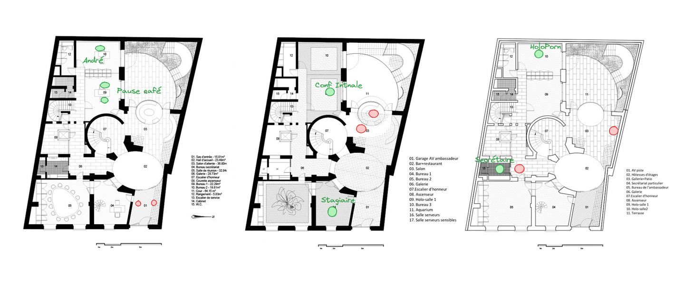

Session basée sur le scénario *Agency Job*, les Edgerunners infiltrent une ambassade pour y voler des données sensibles, découvrant par le jeu les mauvaises pratiques de cybersécurité du quotidien.

<!--more-->



## Détails de l'événement

- **Système :** Cyberpunk Red
- **Lieu :** Médiathèque François Villon, Bourg la Reine
- **Thème :** Cyberpunk, braquage, hygiène cyber
- **Nombre de Joueurs :** 2
- **Durée :** 3h30
- **Scénario :** Agency Job, tiré du livre Cyberpunk 2020 *Tales from the Forlorn Hope*



## À propos de la Session
Mon objectif pour cette session était de proposer un scénario simple sur lequel je pouvais facilement improviser en fonction des idées des joueurs de manière à présenter quelques mauvaises pratiques de cybersécurité. 

La base était la suivante : 
- L'ambassade colombienne utilise un bateau pour faire entrer et sortir des hommes et du matériel en secret dans Night City.
- Les Edgerunners cherchent à se faire un nom au Forlorn Hope, un bar très sélect de vétérans et autres durs à cuire *(crochet initial)*.
- Kronos, un fixer associé à la CIA, les approche et leur propose de récupérer le nom du bateau :
  - Il ne leur donne pas trop de détails mais assez pour qu'ils prennent conscience des risques.
  - S'ils réussissent, ils gagnent la confiance des habitués, s'ils ratent, Kronos trouvera d'autres fusibles à griller...

J'avais préparé le plan de l'ambassade, en y indiquant la position des gardes et de quelques PNJ : 

> *Note:* 
> *Je sais qu'il est préférable d'utiliser une [liste d'adversaires](https://thealexandrian.net/wordpress/45091/roleplaying-games/design-notes-adversary-rosters), mais les avoir sur la carte me permettait de m'y retrouver rapidement, pour un one-shot ça suffisait.*

J'avais également une architecture simple (on remarquera la récupération éhontée et sale de l'architecture du livre de base), au cas où un Netrunner serait de la partie, ce ne fut finalement pas le cas.

Je me suis surtout préparé en relisant [les posts de Justin Alexander](https://thealexandrian.net/wordpress/41217/roleplaying-games/dragon-heist-remix-part-1-the-villains) sur les braquages à travers la campagne *Waterdeep Le Vol des Dragons*, et j'ai prévu de découper la sessions en 3 parties :
### **1. Reconnaissance :**
   
   Réagir aux idées des joueurs pour leur donner un maximum d'informations sur les lieux. Ils avaient 48h pour mener à bien la mission et Kronos leur avait recommandé de ne pas foncer tête baissée dès la fin du briefing. J'avais quelques idées en tête pour leur permettre de tracer un plan intéressant : 
   - Suivre un employé à la sortie du travail et lui voler/cloner son badge.
   - Faire une visite en feignant un rendez-vous.
   - [Faire des recherches sur le net](https://fr.wikipedia.org/wiki/Renseignement_d%27origine_sources_ouvertes) pour découvrir: 
     - Le mot de passe d'un stagiaire pour un site Casino avait fuité, et qu'il réutilise le même mot de passe pour ses accès à l'ambassade. Cela aurait permis de se créer un rendez-vous avec un membre de l'ambassade ou même de transmettre un virus à un autre agent et ainsi gagner l'accès au réseau interne de l'ambassade, pour observer via les caméras et les désactiver au moment opportun par exemple. 
     - La société de ménage de l'entreprise était facilement trouvable sur le net, il était possible de se faire passer pour un agent d'entretien en soudoyant un employé peu regardant. 
     - Les deux agents d'accueil avaient une relation et se sont fait passer pour malades mais ont posté des photos de leurs vacances en ligne, possibilité de chantage.
     - *Plus difficile :* Un des agents de sécurité (affilié à Arasaka) effectuait de la revente d'armes sur le marché noir. Ici aussi, possibilité de chantage avec plus de risques mais aussi potentiellement beaucoup de bénéfices à tirer.
### **2. Infiltration :**
   
   Il y avait 3 grands obstacles à franchir pour accéder au coffre, et la reconnaissance devait permettre aux Edgerunners de préparer un plan pour les contourner d'une manière ou d'une autre :
   - *Rentrer dans le bâtiment :* Situé au 10ème étage d'un mégabuilding, l'entrée disposait d'un portique détecteur de métaux, de deux gardes et d'agents d'accueil.
   - *Un réseau de défense  :* Caméras et drônes de défense directement reliés à Arasaka, avec envoi d'une équipe de réponse dans les 10 minutes.
   - *Une dizaine de gardes :* Tous de chez Arasaka, armés et disciplinés (presque). Potentiellement le plus gros danger, qui permettait de garantir que l'infiltration ne commencerait pas par une fusillade.
   - *Un coffre à code caché :* La surprise de la fin, les Edgerunners n'avaient que peu d'informations sur la localisation des documents qu'ils cherchaient

, et le coffre était là pour proposer un imprévu au moment le plus tendu, quand ils seraient dans le bureau de l'ambassadeur. Le code était une énigme dont la construction fera l'objet d'un post à part mais rapidement : coffre caché derrière une reproduction des Nymphéas, le code faisait 9 chiffres. Dans un tiroir du bureau le post-it "RAPPEL: il a fait les Nymphéas", le code était 666666338, Monet écrit sur un clavier T9.
  


### **3. Fuite et surprise :**

  Pour cette partie, très peu de préparation en réalité. Généralement à ce moment là dans un scénario de Cyberpunk, la moitié de Night City est dans la rue, cracheur au point, et nos chooms sont en train de courir sous une pluie de plomb à la recherche d'un endroit où se faire oublier. 
  Je n'ai encore jamais réussi à implémenter une course-poursuite vraiment satisfaisante donc j'avais prévu de gérer celle-ci comme un [skill challenge](https://koboldpress.com/skill-challenges-for-5e-part-1/), histoire de ne pas trop faire durer la session sans trop négliger cette partie du braquage. 

  En atout dans la manche, j'avais prévu optionnellement de finir la session comme le scénario le propose : Kronos demande aux Edgerunners de localiser le bateau au large de la baie de Night City et de le descendre. Il leur fournit l'équipement de plongée, le bateau et les explosifs et les préviens du périmètre de détection autour et sous le bateau. Un final explosif pour récompenser un groupe efficace. 

## Retour sur l'Événement

Seulement 2 des 5 inscrits se sont présentés (12 et 14 ans), première fois que cela arrive mais c'était sûrement dû à la grippe qui faisait rage pile sur cette période. Les deux participants ont choisi leur [personnage prétirés](https://rtalsoriangames.com/wp-content/uploads/2021/02/RTG-CPRed-SingleShotPackv1.1.pdf) : Forty la Rockergirl et Mover le Solo. 

> **Pas de Netrunner ?**
> J'ai introduit Redeye, le Netrunner du pack de prétirés, comme un PNJ, le troisième larron de leur équipe de choc, le [mec dans le fauteuil](https://www.youtube.com/watch?v=8nAK0Ifptzc). Il n'était pas particulièrement proactif mais leur a permis de désactiver les caméras de surveillance une fois que les edgerunners ont réussi à le connecter au réseau de l'ambassade (il a dû faire un lancer pour ça, si il avait raté il aurait déclanché l'alarme. Les PNJ ne sont pas infaillibles).

Chose rare, le scénario s'est déroulé quasiment comme je l'avais préparé ! Rapidement pris dans l'excitation de braquer un bâtiment sous haute surveillance, les edgerunners se sont focalisés sur les gardes et les agents d'entretiens. Ils ont réussi à mettre la main sur 2 gardes : 
- Jake, un fan de Forty de la première heure, qu'il a eu l'occasion de rencontrer alors que Mover prenait son chien en otage pour le forcer à coopérer (moment à la fois tendu et drôle).
- Blake, qui traffiquait des armes sur le marché noir et s'est fait prendre la main dans le sac par les héros. 
Les gardes ont donc tous deux accepté d'éteindre le portique à l'entrée pour laisser les edgerunners rentrer avec leurs armes, déguisés en agents de ménage après avoir soudoyé les vrais employés. Les agents d'accueil ont ensuite accepté en pâlissant de brancher la clé USB (un éclat si on veut être plus rôle play) qui leur était tendue par Jake en les menaçant de révéler la vraie raison de leur récente absence, pendant que les edgerunners se dirigeaient vers l'étage. 
Après quelques bons jets et interactions astucieuses, Mover se retrouvait dans le bureau de l'ambassadeur pendant que Forty faisait mine de nettoyer devant. Mais celle-ci a été reconnue par la secrétaire de l'ambassadeur qui faisait des heures sup' et les choses ont commencé à chauffer devant le bureau. 

Alors que Forty commençait à arroser les gardes qui l'avaient démasquée, Mover finit par trouver le code du coffre, et tous deux sont sortis en trombe de l'ambassade, dans une fusillade intense où Mover a faillit perdre la vie en protégeant sa partenaire. Arrivés dehors, ils ont compris qu'ils avaient oublié un aspect important de leur plan : **la fuite**. Heureusement, Blake arriva à ce moment pour les ramasser et leur demander 25% de leur butin en échange de son sauvetage (à Night City, personne n'est gentil gratuitement...). 

Habituellement, j'aurais arrêté là. La session faisait déjà 3h et c'est généralement un miracle que la concentration d'enfants de cet âge tienne si longtemps. Mais les bougres en voulaient encore et il restait un bateau à faire exploser. Ce fut un final spectaculaire, résolu par un skill challenge très narratif où les deux héros ont eu l'occasion de briller avant de s'enfuir dos à l'explosion du bateau de contrebande. 

## Remerciements 
Tout d'abord, un grand merci au joueur de Mover et à la joueuse de Forty, ils ont été des joueurs idéaux et ce fut un plaisir d'animer cette session pour eux. Nous avons pas mal bavardés ensuite (et faillit se faire enfermer dans la médiathèque qui fermait...) et la discussion était très intéressante ! En espérant

 les revoirs lors de prochaines animations.

Ensuite, évidemment, je tiens à remercier le personnel de la [Médiathèque François Villon](https://www.mediablr.net/), en particulier Chloé, Pierre et Pierre-Marc, pour avoir donné de leur temps et de leur personne afin de monter ce projet d'animations JDR et avoir toujours été présents et à l'écoute pour construire ce projet ensemble. 

Enfin, il me faut remercier [Formind](https://www.formind.fr/fr/) chez qui je travaillais alors et qui a gracieusement fait don d'un kit de jeu Cyberpunk Red complet à la médiathèque afin de permettre cette session et de soutenir cette initiative ludique d'éveil de la jeunesse aux problèmes de demain. 